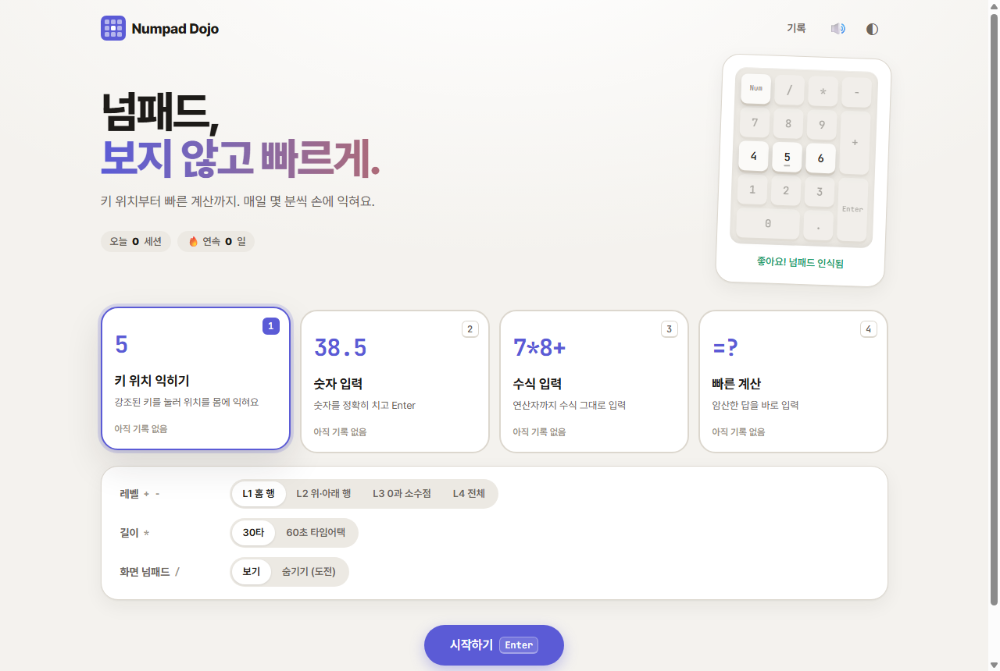
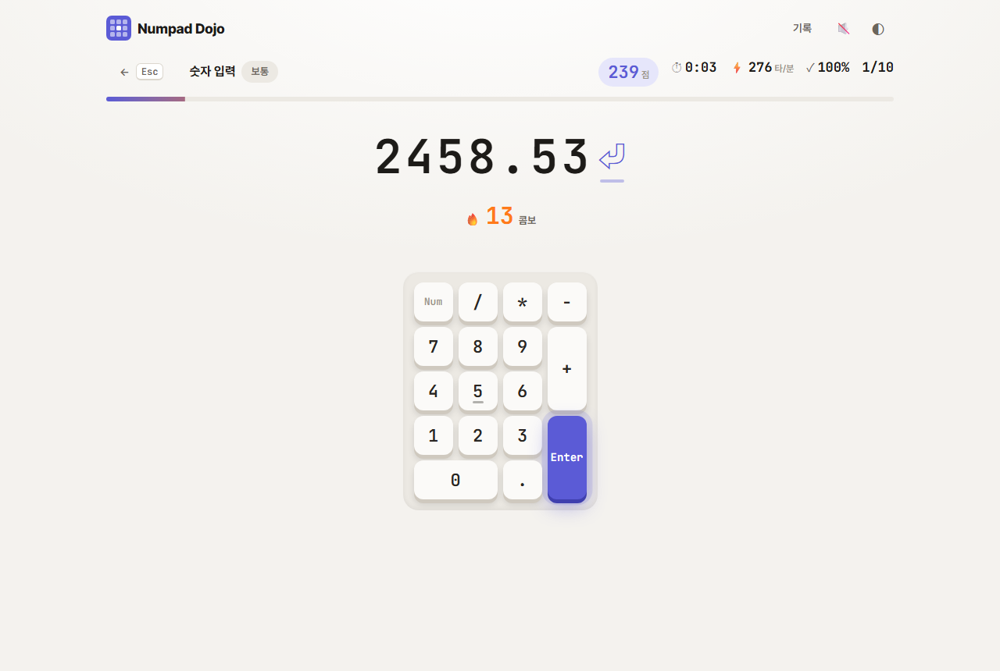
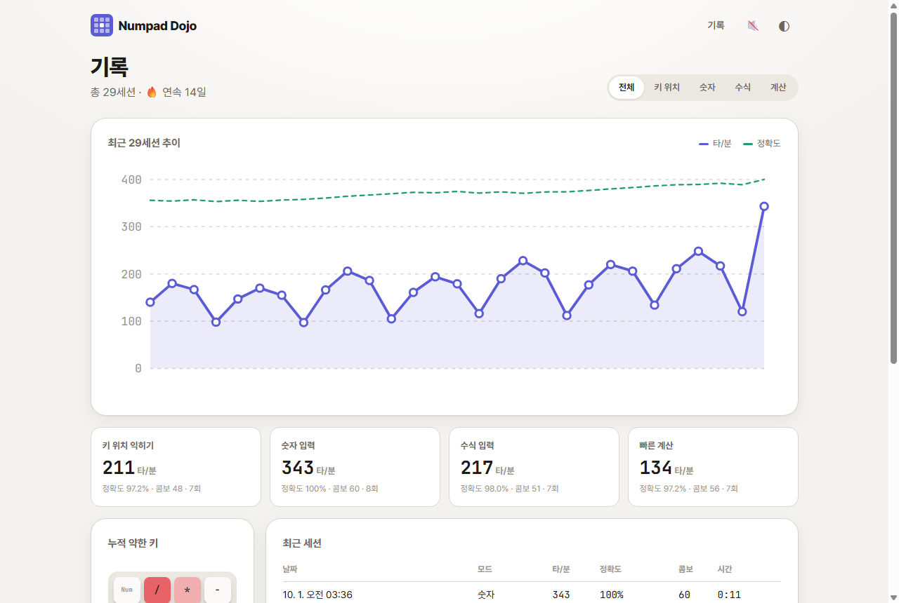
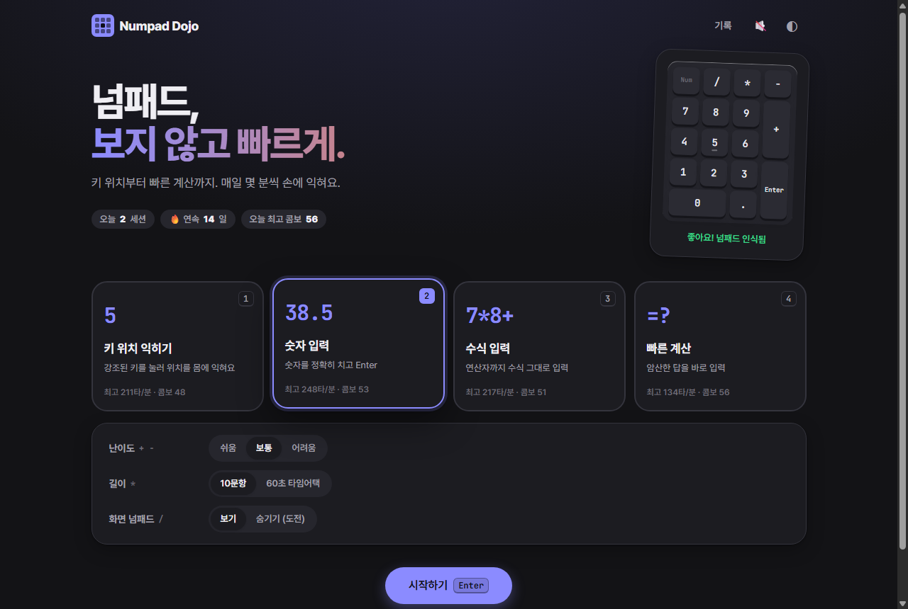

# Numpad Dojo

> 넘패드, 보지 않고 빠르게.

넘패드에 익숙해지고 숫자와 계산을 빠르게 입력하는 습관을 기르는 연습장입니다.
콤보, 효과음, 기록 그래프로 재미있게 연습할 수 있습니다.

**바로 연습하기 →** https://gwangwon91.github.io/Numpad/



| 연습 | 결과 |
|---|---|
|  |  |

| 기록 | 다크 모드 |
|---|---|
|  |  |

## 재미 요소

- 🔥 **콤보**: 연속으로 맞히면 콤보가 오르고, 효과음 음높이도 함께 올라갑니다
- 🎉 **최고 기록 축하**: 속도·정확도·콤보 최고 기록을 넘으면 색종이가 터집니다
- 🅢 **정확도 등급**: S(99%) · A(96%) · B(90%) · C
- 🗺️ **약한 키 히트맵**: 자주 틀리는 키가 넘패드 위에 붉게 표시됩니다
- 📈 **성장 그래프**와 🔥 **연속 연습 일수**

## 넘패드만으로 조작

| 화면 | 키 |
|---|---|
| 홈 | `1`–`4` 모드 · `+` `−` 레벨/난이도 · `*` 문항↔60초 · `/` 화면 넘패드 표시 · `Enter` 시작 · `0` 기록 |
| 연습 | 넘패드로 입력 · `Esc` 그만하기 |
| 결과 | `Enter` 다시 하기 · `0` 홈 · `.` 기록 |

## 연습 모드

| 모드 | 하는 일 |
|---|---|
| 키 위치 익히기 | 화면에 강조된 키를 누릅니다. 홈 포지션 `4 5 6`부터 레벨별로 넓혀 갑니다 |
| 숫자 입력 | `38450`, `12.75` 같은 숫자를 정확히 입력하고 `Enter` |
| 수식 입력 | `1250*0.15+320` 같은 수식을 연산자 키까지 그대로 입력 |
| 빠른 계산 | `37 + 48` 같은 문제의 답을 넘패드로 빠르게 입력 |

모든 모드는 문항 수 또는 60초 타임어택으로 할 수 있고, 속도(타/분)와 정확도, 자주 틀리는 키가 기록됩니다.
기록은 브라우저(localStorage)에만 저장됩니다.

## 로컬에서 실행

ES 모듈을 쓰므로 `index.html`을 파일로 직접 열지 말고 로컬 서버로 여세요.

```bash
node tests/e2e/server.mjs 8080
# 또는
python -m http.server 8080
```

브라우저에서 `http://127.0.0.1:8080/` 을 엽니다.

## 테스트

```bash
npm test                       # 순수 로직 단위 테스트 (node --test)
npm run test:e2e               # 헤드리스 Chrome으로 실제 키 입력 E2E 테스트
node tests/e2e/screenshots.mjs # README 스크린샷 다시 만들기
```

테스트와 도구는 Node 22 이상, Chrome 또는 Edge만 있으면 되고 설치할 패키지는 없습니다.

## 구조

```
index.html
css/        디자인 토큰, 기본 스타일, 컴포넌트, 화면별 스타일
js/core/    입력 판정, 문제 생성, 세션, 통계, 저장 (DOM을 모르는 순수 로직)
js/ui/      화면 넘패드, 그래프, 축하 효과
js/screens/ 홈, 연습, 결과, 기록 화면
docs/       요구사항, 설계, 테스트 체크리스트
tests/      단위 테스트, E2E 테스트
```

빌드 도구 없이 순수 HTML, CSS, JavaScript로 만들었습니다.

## 문서

- [요구사항 명세](docs/requirements.md)
- [설계 문서](docs/design.md)
- [테스트 체크리스트](docs/test-checklist.md)

## 라이선스

MIT
